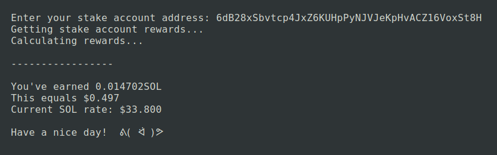

# Solana Stake Income Calculator

In fact, this is a very simple PHP-script 🙃

**The script works only CLI mode.**

The Calculator uses public data about Solana stake accounts from [solscan.io](https://solscan.io/).

Also, the Calculator uses [CoinGecko API](https://www.coingecko.com/ru/api) to get SOL price.

## Usage

1. Run the script `php main.php`
2. Enter stake account address
3. Wait the result

If you don't have a stake account you can use any stranger address to test the Calculator.

Use this address to test: `6dB28xSbvtcp4JxZ6KUHpPyNJVJeKpHvACZ16VoxSt8H`
